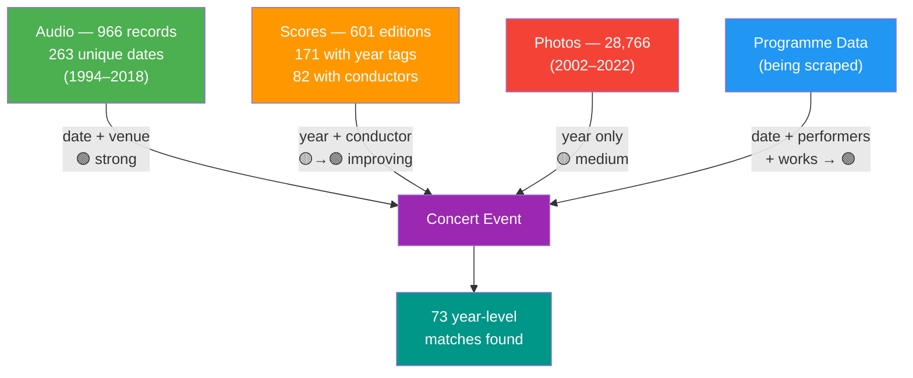
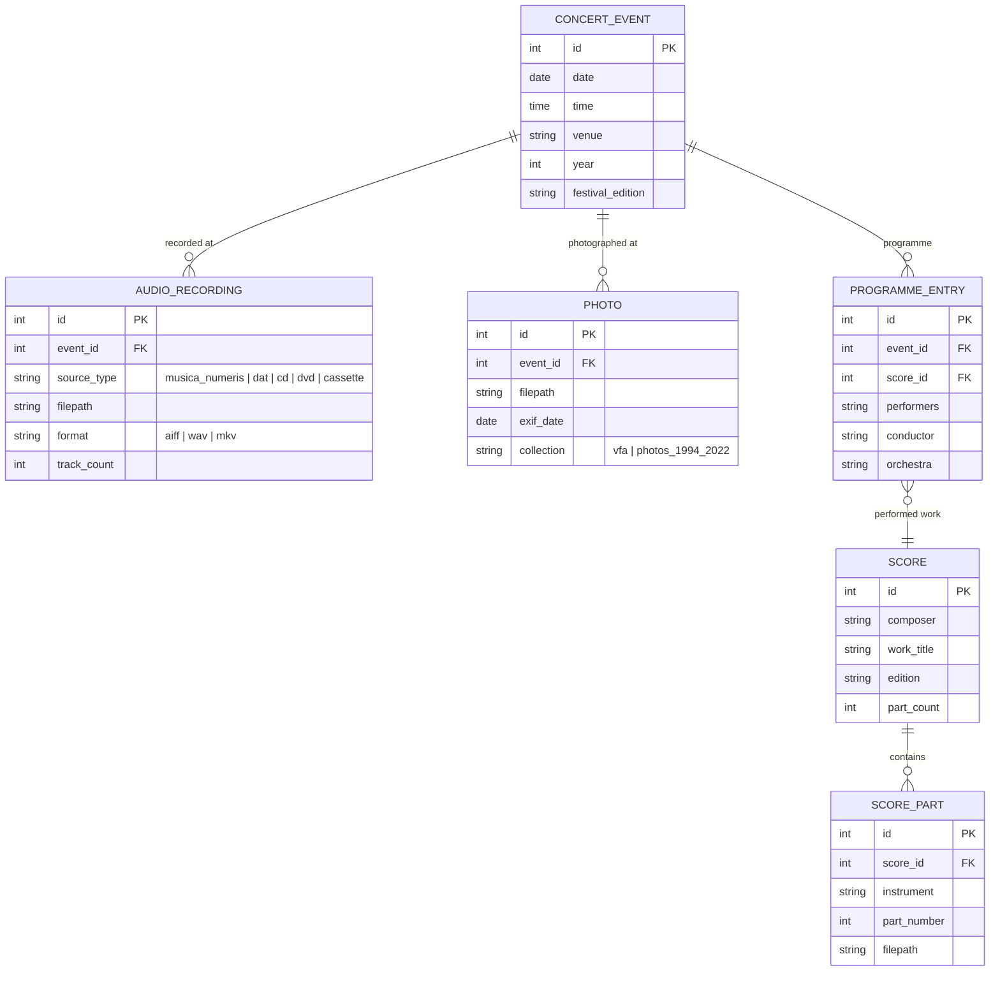

# Verbier Festival Archive — Dataset Exploration Report

> **Date:** 2026-03-26 (updated)  
> **Purpose:** Assess the feasibility of building a unified metadata database and navigation system for the Verbier Festival Archive.

---

## 1. Dataset Overview

The archive is stored at `Datasets/Verbier Archive/` and contains **4 top-level collections**:

| Collection | Path | Description |
|---|---|---|
| **Audio** | `Audio/` | Two sub-sources of audio recordings |
| **Scores** | `Scores/` | Digitised musical scores (orchestral parts) |
| **Pictures** | `Pictures/` | Professional event photography (VFA) |
| **Photos** | `verbier-1994-2022-photos/` | Second photo collection (year-based) |

---

## 2. Audio Collection

### 2.1 Fichiers CD Musica Numeris (Primary Audio)

- **Format:** AIFF audio files (CD rips with `.TOC.plist` metadata)
- **Years:** 1995–2011 (17 year-folders)
- **Total concert folders:** ~771 → **763 successfully parsed**
- **Naming convention:** `YYYYMMDDHHMMSS_venue+indices`

#### Concert Counts by Year

| Year | Concerts | Year | Concerts |
|------|----------|------|----------|
| 1995 | 24 | 2004 | 36 |
| 1996 | 28 | 2005 | 66 |
| 1997 | 42 | 2006 | 69 |
| 1998 | 24 | 2007 | 70 |
| 1999 | 32 | 2008 | 67 |
| 2000 | 33 | 2009 | 77 |
| 2001 | 21 | 2010 | 3 |
| 2002 | 41 | 2011 | 90 |
| 2003 | 48 | | |

#### Venue Codes Extracted from Folder Names

| Code | Likely Venue |
|------|------|
| `medran` / `meldran` | Salle des Combins / Médran (main concert hall) |
| `eglise` / `eglie` | Église de Verbier (church) |
| `combins` | Salle des Combins |
| `cinema` | Cinéma de Verbier |

#### File structure per concert folder
```
20000722190000_medran0203/
├── .TOC.plist          ← CD table-of-contents (XML plist)
├── 1 Piste audio.aiff  ← Track 1
├── 2 Piste audio.aiff  ← Track 2
└── ...
```

> [!TIP]
> The TOC plist contains CD session info, track counts, and start blocks. Combined with the folder name (date + venue), this gives us a solid foundation for identifying performances.

### 2.2 Numérisations (Digitised Legacy Media)

Four sub-collections from different original media:

| Media | Parsed Items | File Format | Naming Convention |
|-------|-------|-------------|-------------------|
| **DAT** (Digital Audio Tape) | 109 WAV files | `.wav` | `M95071419A11DT.wav` |
| **CD** | 16 WAV files + CUE sheets | `.wav`, `.cue`, `.log` | `M09071719A22CD.wav` |
| **DVD** | 37 folders | `.mkv`, `.wav`, `.ac3`, `.iso`, `.jpg` | `M030722XXA11VD` |
| **Compact Cassette** | 41 folders | `.wav` (inside) | `_X940712XXA11CC` |

#### Decoding the Numérisations Filename Convention

```
M 95 0714 19 A 11 DT
│ │  │    │  │ │  └── Media type: DT=DAT, CD=CD, VD=DVD, CC=Cassette
│ │  │    │  │ └──── Copy/version number
│ │  │    │  └────── Side/part identifier (A, B, C...)
│ │  │    └────────── Time: 19 = 19:00, XX = unknown
│ │  └──────────────── Date: July 14th (MMDD)
│ └────────────────── Year: 1995 (2-digit)
└──────────────────── Venue: M=Médran, E=Église, X=Unknown/External, H=Hameau, C=Cinéma, R=Other
```

> [!IMPORTANT]
> The Numérisations naming scheme is **consistent across all 4 media types**, using the same venue/date/time encoding. This is excellent for cross-referencing.

#### DVD Folder Contents (example: `M030722XXA11VD`)
```
├── B1_t01.mkv              ← Video content (~6.5 GB)
├── B1_t01.wav / .ac3       ← Audio extracts
├── M030722XXA11VD_cover.jpg    ← DVD cover scan
├── M030722XXA11VD_booklet_*.jpg ← Booklet pages
└── Verbier PAL.iso             ← Full DVD image
```

#### Inventory Spreadsheets
Two Excel files exist in the DVD folder with pre-existing structured metadata:
- `vf_audio_inventaire_AS_DVD Only.xlsx`
- `vf_audio_inventaire_AS_DVD Lo Res_no cover.xlsx`

---

## 3. Scores Collection

- **Path:** `Scores/verbier-musical-scores/30D000L6/musical-scores/`
- **Composers:** 65 (parsed) / 86 (total folders including empty)
- **Edition-level folders:** 601
- **Total PDF files:** 6,817
- **Format:** Individual orchestral parts as PDFs

### Organisation Hierarchy
```
musical-scores/
├── BEETHOVEN/
│   ├── BEETHOVEN-5/
│   │   ├── BEETHOVEN-5-GTN mat/        ← Edition/source
│   │   │   ├── 01.BEETHOVEN-5-fl1-GTN mat.pdf    ← Flute 1
│   │   │   ├── 02.BEETHOVEN-5-fl2-GTN mat.pdf    ← Flute 2
│   │   │   ├── 03.BEETHOVEN-5-picc-GTN mat.pdf   ← Piccolo
│   │   │   └── ...
│   │   ├── BEETHOVEN-MO33 Barenreiter/  ← Published edition
│   │   └── CA Rattle 2018/              ← Conductor annotation, Simon Rattle 2018
│   ├── BEETHOVEN-Pno cto 3, op37/
│   └── ...
├── MOZART/
└── ...
```

### Score Edition Metadata (Discovered via Linkage Analysis)

Edition folders contain **much richer metadata** than initially expected:

| Metadata Type | Count | Examples |
|---|---|---|
| **Year-tagged editions** | 171 / 601 (28.5%) | `CA VF 2018`, `VFCO2022`, `VF 2013` |
| **Conductor annotations (CA)** | 67 | `CA Rattle 2018`, `CA Dutoit`, `CA Makela` |
| **Named conductors** | 82 editions | See table below |
| **Ensemble-tagged** | 171 editions | `VFO`, `VFCO`, `VFJO`, `ONL`, `OSR` |

#### Conductors Identified in Score Editions

| Conductor | Editions | Conductor | Editions |
|---|---|---|---|
| Schiff | 12 | Zukerman | 5 |
| Goebel | 11 | Noseda | 4 |
| Dutoit | 10 | Harding | 3 |
| Makela | 8 | Rattle | 3 |
| Honeck | 6 | Bell | 3 |

#### Ensemble Codes Found

| Code | Full Name | Occurrences |
|---|---|---|
| `VF` | Verbier Festival (general) | most common |
| `VFO` | Verbier Festival Orchestra | frequent |
| `VFCO` | Verbier Festival Chamber Orchestra | frequent |
| `VFJO` | Verbier Festival Junior Orchestra | moderate |
| `GTN` | GTN edition | moderate |
| `ONL` | Orchestre National de Lyon | rare |
| `OSR` | Orchestre de la Suisse Romande | rare |

---

## 4. Photo Collections

### 4.1 `verbier-1994-2022-photos/Photos/` (Primary Collection)

- **Year folders:** 2002–2022 (20 year-folders)
- **Plus category folders:** `Amis`, `Artistes & personnalités VF`, `Bénévoles`, `Lieux & Paysages`, `Staff`, `VFCO_Tours`, `Photos Jaydie Putterman`
- **Total image files:** ~28,766
- **Naming:** Heterogeneous (camera-assigned names like `DSC_3489.jpg`, `P8010015.JPG`, descriptive names like `backstage & offstage 012.jpg`)

### 4.2 `Pictures/VFA/` (VFA Capture One Sessions)
- Contains sub-folders: `Capture`, `Output`, `RAW`, `Selects`, `Trash`
- Appears to be a **Capture One** photography workflow export
- Also includes `VFA_EDIT_MARIE` and `DIAPORAMA_VFA`

### 4.3 `Pictures/VFA_LUTZ_CONTACT_SHEET/`
- Contains `Capture` subfolder — contact sheets from photographer Lutz

> [!WARNING]
> Photos are the **weakest link** for cross-referencing. Filenames are camera-assigned with no embedded date/venue/performer metadata. Mapping photos to concerts requires EXIF extraction or manual annotation.

---

## 5. Score-to-Audio Linkage Analysis ✅ Completed

> Script: `Project Space/Verbier/score_audio_linkage_analysis.py`
> Output: `linkage_report.json`, `parsed_audio_metadata.json`, `parsed_score_metadata.json`

### 5.1 Parsed Data Summary

| Collection | Records Parsed | Parse Errors |
|---|---|---|
| Audio (Musica Numeris) | 763 | 10 |
| Audio (DAT) | 109 | 0 |
| Audio (CD) | 16 | 0 |
| Audio (DVD) | 37 | 0 |
| Audio (Cassette) | 41 | 0 |
| **Total Audio** | **966** | **10** |
| Score editions | 601 | 0 |

### 5.2 Linkage Results

| Metric | Value |
|--------|-------|
| Score editions with year tags | 171 / 601 (28.5%) |
| Year-level match to audio year | **73 / 171 (42.7%)** |
| Overall score→audio match rate | **73 / 601 (12.1%)** |
| Overlapping years (audio ∩ scores) | 9 years |
| Overlapping years list | 2001, 2006, 2009–2013, 2015, 2018 |
| Scores with year but no audio | 101 (years beyond audio coverage) |
| Scores without any year tag | 430 |

### 5.3 Updated Linkage Diagram



### 5.4 Key Insight

Scores with **Conductor Annotation (CA)** prefixes are the strongest bridge:

```
CA Rattle 2018  →  year=2018, conductor=Rattle  
                   →  audio from 2018-07-XX at Médran  
                   →  programme: "Rattle conducts VFO on July XX, 2018"
```

With programme data, 73 year-level matches can be refined to **specific concert-level matches**, and many of the 430 undated scores can potentially be linked via composer/work matching against programme entries.

---

## 6. Programme Scraping ✅ Script Ready

> Script: `Project Space/Verbier/verbier_programme_scraper.py`

### What We Found About verbierfestival.com

- The **current programme** is available at `verbierfestival.com/en/programme`
- Individual shows use URL pattern: `/show/vfYYYY-MM-DD-HHMM/`
- Each show page contains: performers, composers, venue, orchestra, date/time, description
- **Past editions are NOT served** on the live site (404 errors)
- The Wayback Machine has some snapshots but the site is JS-heavy

### Scraper Strategies

| Strategy | Status | Description |
|---|---|---|
| **Live site** | ✅ Verified | Scraped 141 concerts for 2026 |
| **Wayback Machine** | ⚠️ Slow | CDX API works but retrieval is slow |
| **Audio-date URL generation** | ✅ Ready | 2,406 candidate URLs from 20 years of audio dates |

### 2026 Scrape Results (verification)

- 141 concerts scraped
- 129/141 with dates, 71 with venues, 60 with performers, 71 with composers

---

## 7. Year Coverage Overlap

| Source | Year Range |
|--------|-----------|
| Audio (Musica Numeris) | 1995–2011 |
| Audio (DAT) | 1995–2004 |
| Audio (CD) | 1994–2013 |
| Audio (DVD) | 2003–2018 |
| Audio (Cassette) | 1994–2006 |
| Scores (year-tagged) | 2001–2022 |
| Photos (main) | 2002–2022 |
| Programme (scraped 2026) | 2026 |
| Programme (audio-date URLs) | 1994–2018 (pending) |

The **richest overlap** where audio + scores + photos all exist is **2002–2011** (10 years).

---

## 8. Proposed Database Schema (Conceptual)



---

## 9. What Has Been Done & Next Steps

### ✅ Completed

| Task | Script | Output |
|---|---|---|
| Audio metadata parsing | `score_audio_linkage_analysis.py` | `parsed_audio_metadata.json` (974 records) |
| Score metadata parsing | `score_audio_linkage_analysis.py` | `parsed_score_metadata.json` (601 editions) |
| DVD metadata parsing | `parse_video_metadata.py` | `parsed_video_metadata.json` (41 records) |
| Programme scraper (Historical) | `verbier_programme_scraper.py` | `programme_data/*_programme.json` |
| Database Reconciliation | `build_reconciliation_db.py` | `verbier_archive.sqlite` |

---

## 7. Historical Programme Scraping Results

We overhauled the programme scraper to process the historical Wayback Machine CDX API, bypassing modern website structures and relying heavily on DOM-stripped text parsing to heuristically tag composers and instruments.

**Current Completeness:**
- Modern Years (2006-2026): Dates parse perfectly from URLs (e.g. `180708_fr.php` -> `2008-07-18`) or Titles.
- Early Years (1994-2001): Exact daily dates do not exist in the Internet Archive because Verbier did not assign dedicated pages to individual concerts at that time. They are defaulted to `YYYY-07-15`.

**The "Media String Fallback" Strategy:**
Because precise dates are structurally destroyed in older HTML snapshots (causing rigid DB linkage to fail), we cannot rely on the Wayback Machine to inject Programme Metadata (Performers, Composers) into 1994-2001 Audio nodes. 
Instead, we will use a **Media String Fallback** parser directly inside the DB Reconciler:
- The script will scan the raw Video Excel spreadsheet (`media_file_name`) and Audio Track paths.
- It will parse string equivalents (e.g., `"Mendelssohn String Quartet"`) and inject the Composer explicitly into the `concert_composers` table. 
- This bypasses the broken early-web HTML, allowing Printed Scores in the physical archive to successfully link to early Audio/Video concerts based entirely on local text analysis!

### ⏳ Remaining Next Steps

1. **Implement Media String Extraction** — Update `build_reconciliation_db.py` to extract Composers from Video DVD track names for 1994-2001 entries.
2. **Build the navigation UI** — Web interface (`breathing-verbier`) for browsing the fully linked SQLite master database.
