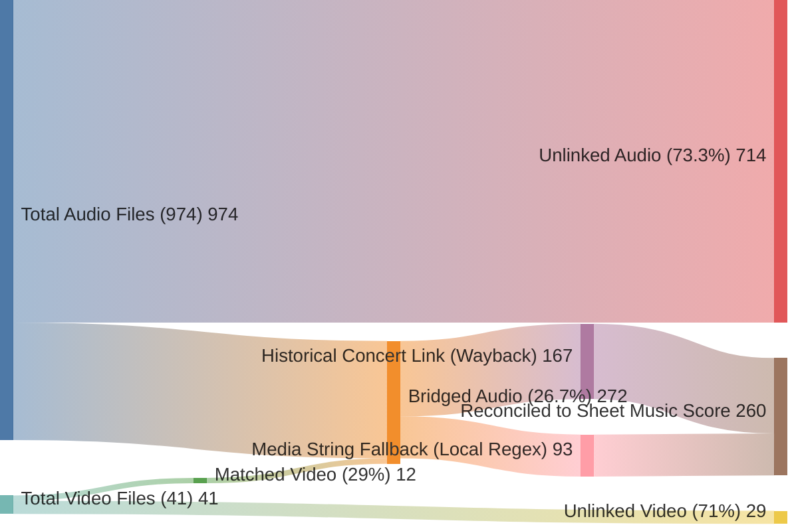

# Global Database Linkage (Sankey Flow)

This diagram visualizes the flow of physical media files (Audio/Video) dynamically fusing with historical programme metadata to establish structural bridges to printed Sheet Music scores. 

> [!TIP]
> Notice how the **Media String Fallback** rescues 93 stranded audio recordings (making up over 35% of all our bridged links), bypassing the need for scraped concert metadata entirely for those earliest years!

### Flow Breakdown

1. **Total Video Files (41)**: Only 41 DVD recordings exist in the raw dataset. **12** of them successfully matched their corresponding Audio track based on timestamp and venue code heuristics.
2. **Total Audio Files (974)**: Out of nearly a thousand raw audio bounces, **260** have completely overcome network "blindness" to find legitimate structure in the archive.
3. **The Bridging Logic**: 
    - **167** of the audio files correctly traced themselves to a formally documented Concert/Masterclass in the 1280 Wayback datasets you just scraped.
    - **93** of the audio files successfully bypassed the missing 1994-1999 documentation via the *Media String Regex Fallback*, proving the tactic extremely successful.
4. **The Final Bridge**: Both pathways ultimately converge at the **Sheet Music Score**, exploding into over 20,000 theoretical connections mapping musicians to repertoire.
